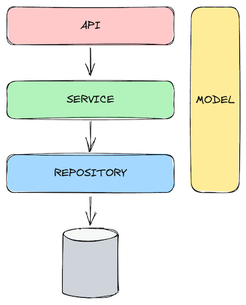

# Test your architecture with ArchUnit

## Learning Goals

- ✅ Understand the advantages of using a library like `ArchUnit`
- ✅ Clarify how we can use it on different architectures

## Format 

- 💡 Prerequisites : 
  - Java 21
  - Maven
  - your favorite IDE


In this kata exercise, you will learn how to use **ArchUnit** to enforce architectural constraints in 
a Java project. ArchUnit is a Java library that allows you to write unit tests to check the architecture of your code. 
You'll understand how to use it to ensure that your codebase adheres to specific architectural rules.


## Why testing your architecture?

Drawing nice architecture diagrams is a good start, but it's not enough.
The project get bigger, the team changes, and the architecture starts to drift away from the initial design.
Suddenly everything depends on everything, and it becomes difficult to understand the architecture of the project.
A safe way to ensure that the architecture is respected is to write tests that check it. 
They can be automated and part of the CI/CD pipeline.

With tests, you can ensure that:
- Team rules are not broken by inadvertence 👍
  - e.g. `no direct access to the database`
- Structural architecture decisions are respected and documented 👍
  - e.g. `no circular dependencies between packages`
- They are checked and enforced automatically 👍


### How to use ArchUnit?

ArchUnit provides a set of rules that you can use to check the architecture of your code.
These rules are written in a way that makes it easy to understand and maintain.

#### Package Dependency Checks Example


```java
noClasses().that().resideInAPackage("..source..")
    .should().dependOnClassesThat().resideInAPackage("..foo..")
```

## Exercises

### #1 Layered Architecture - Write your tests


The package `codekata.archunit.layered_architecture` contains a simple implementation of a layered architecture.




#### TO DO 

Complete the following tests in the following classes:

- [ ] `LayeredArchitectureTests`
- [ ] `NamingConventionTests`
- [ ] `CodingRulesTests`

Which other rules could be added?
 

### #2 Onion Architecture - Fix your architecture


The package `codekata.archunit.onion_architecture` contains an architecture that is not compliant with the
onion architecture.

#### TO DO

- [ ] Run the existing tests in the following class `OnionArchitectureTests` 
- [ ] Fix the architecture to make the tests pass

# Resources

- [ArchUnit](https://www.archunit.org/)
- [ArchUnit Use Cases](https://www.archunit.org/use-cases)
- [ArchUnit User Guide](https://www.archunit.org/userguide/html/000_Index.html)
