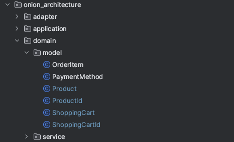
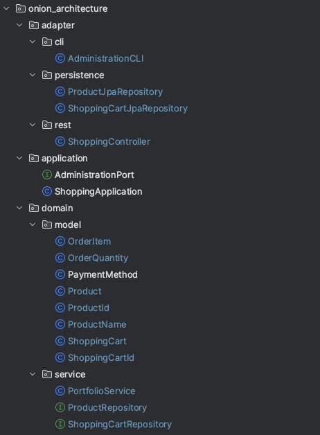

# Onion Architecture Solution

## Anatomy of the test

```java
@ArchTest
static final ArchRule onion_architecture_is_respected = onionArchitecture()
        .domainModels("..domain.model..")
        .domainServices("..domain.service..")
        .applicationServices("..application..")
        .adapter("cli", "..adapter.cli..")
        .adapter("persistence", "..adapter.persistence..")
        .adapter("rest", "..adapter.rest..");
```

## Run the test
First, let's run the tests to see what's wrong with the architecture.

▶️ Run [OnionArchitectureTest.java](../../archunit-kata/src/test/java/codekata/archunit/onion_architecture/OnionArchitectureTest.java)

```

java.lang.AssertionError: Architecture Violation [Priority: MEDIUM] - Rule 'Onion architecture consisting of
domain models ('..domain.model..')
domain services ('..domain.service..')
application services ('..application..')
adapter 'cli' ('..adapter.cli..')
adapter 'persistence' ('..adapter.persistence..')
adapter 'rest' ('..adapter.rest..')' was violated (21 times):
Constructor <codekata.archunit.onion_architecture.domain.model.OrderItem.<init>(codekata.archunit.onion_architecture.domain.model.Product, codekata.archunit.onion_architecture.domain.service.OrderQuantity)> has parameter of type <codekata.archunit.onion_architecture.domain.service.OrderQuantity> in (OrderItem.java:0)
Constructor <codekata.archunit.onion_architecture.domain.model.Product.<init>(codekata.archunit.onion_architecture.adapter.persistence.ProductId, codekata.archunit.onion_architecture.domain.service.ProductName)> has parameter of type <codekata.archunit.onion_architecture.adapter.persistence.ProductId> in (Product.java:0)
Constructor <codekata.archunit.onion_architecture.domain.model.Product.<init>(codekata.archunit.onion_architecture.adapter.persistence.ProductId, codekata.archunit.onion_architecture.domain.service.ProductName)> has parameter of type <codekata.archunit.onion_architecture.domain.service.ProductName> in (Product.java:0)
Constructor <codekata.archunit.onion_architecture.domain.model.ShoppingCart.<init>(codekata.archunit.onion_architecture.adapter.persistence.ShoppingCartId)> has parameter of type <codekata.archunit.onion_architecture.adapter.persistence.ShoppingCartId> in (ShoppingCart.java:0)
Constructor <codekata.archunit.onion_architecture.domain.service.PortfolioService.<init>(codekata.archunit.onion_architecture.adapter.persistence.ShoppingCartRepository, codekata.archunit.onion_architecture.adapter.persistence.ProductRepository)> has parameter of type <codekata.archunit.onion_architecture.adapter.persistence.ProductRepository> in (PortfolioService.java:0)
Constructor <codekata.archunit.onion_architecture.domain.service.PortfolioService.<init>(codekata.archunit.onion_architecture.adapter.persistence.ShoppingCartRepository, codekata.archunit.onion_architecture.adapter.persistence.ProductRepository)> has parameter of type <codekata.archunit.onion_architecture.adapter.persistence.ShoppingCartRepository> in (PortfolioService.java:0)
Field <codekata.archunit.onion_architecture.domain.model.OrderItem.quantity> has type <codekata.archunit.onion_architecture.domain.service.OrderQuantity> in (OrderItem.java:0)
Field <codekata.archunit.onion_architecture.domain.model.Product.id> has type <codekata.archunit.onion_architecture.adapter.persistence.ProductId> in (Product.java:0)
Field <codekata.archunit.onion_architecture.domain.model.Product.name> has type <codekata.archunit.onion_architecture.domain.service.ProductName> in (Product.java:0)
Field <codekata.archunit.onion_architecture.domain.model.ShoppingCart.id> has type <codekata.archunit.onion_architecture.adapter.persistence.ShoppingCartId> in (ShoppingCart.java:0)
Field <codekata.archunit.onion_architecture.domain.service.PortfolioService.productRepository> has type <codekata.archunit.onion_architecture.adapter.persistence.ProductRepository> in (PortfolioService.java:0)
Field <codekata.archunit.onion_architecture.domain.service.PortfolioService.shoppingCartRepository> has type <codekata.archunit.onion_architecture.adapter.persistence.ShoppingCartRepository> in (PortfolioService.java:0)
Method <codekata.archunit.onion_architecture.adapter.cli.AdministrationCLI.handle([Ljava.lang.String;, codekata.archunit.onion_architecture.application.AdministrationPort)> calls method <codekata.archunit.onion_architecture.adapter.persistence.ProductRepository.getTotalCount()> in (AdministrationCLI.java:17)
Method <codekata.archunit.onion_architecture.adapter.cli.AdministrationCLI.handle([Ljava.lang.String;, codekata.archunit.onion_architecture.application.AdministrationPort)> references class object <codekata.archunit.onion_architecture.adapter.persistence.ProductRepository> in (AdministrationCLI.java:16)
Method <codekata.archunit.onion_architecture.adapter.rest.ShoppingController.addToShoppingCart(java.util.UUID, java.util.UUID, int)> calls constructor <codekata.archunit.onion_architecture.adapter.persistence.ProductId.<init>(java.util.UUID)> in (ShoppingController.java:20)
Method <codekata.archunit.onion_architecture.adapter.rest.ShoppingController.addToShoppingCart(java.util.UUID, java.util.UUID, int)> calls constructor <codekata.archunit.onion_architecture.adapter.persistence.ShoppingCartId.<init>(java.util.UUID)> in (ShoppingController.java:20)
Method <codekata.archunit.onion_architecture.domain.service.PortfolioService.addToShoppingCart(codekata.archunit.onion_architecture.adapter.persistence.ShoppingCartId, codekata.archunit.onion_architecture.adapter.persistence.ProductId, codekata.archunit.onion_architecture.domain.service.OrderQuantity)> calls method <codekata.archunit.onion_architecture.adapter.persistence.ProductRepository.read(codekata.archunit.onion_architecture.adapter.persistence.ProductId)> in (PortfolioService.java:22)
Method <codekata.archunit.onion_architecture.domain.service.PortfolioService.addToShoppingCart(codekata.archunit.onion_architecture.adapter.persistence.ShoppingCartId, codekata.archunit.onion_architecture.adapter.persistence.ProductId, codekata.archunit.onion_architecture.domain.service.OrderQuantity)> calls method <codekata.archunit.onion_architecture.adapter.persistence.ShoppingCartRepository.read(codekata.archunit.onion_architecture.adapter.persistence.ShoppingCartId)> in (PortfolioService.java:21)
Method <codekata.archunit.onion_architecture.domain.service.PortfolioService.addToShoppingCart(codekata.archunit.onion_architecture.adapter.persistence.ShoppingCartId, codekata.archunit.onion_architecture.adapter.persistence.ProductId, codekata.archunit.onion_architecture.domain.service.OrderQuantity)> calls method <codekata.archunit.onion_architecture.adapter.persistence.ShoppingCartRepository.save(codekata.archunit.onion_architecture.domain.model.ShoppingCart)> in (PortfolioService.java:25)
Method <codekata.archunit.onion_architecture.domain.service.PortfolioService.addToShoppingCart(codekata.archunit.onion_architecture.adapter.persistence.ShoppingCartId, codekata.archunit.onion_architecture.adapter.persistence.ProductId, codekata.archunit.onion_architecture.domain.service.OrderQuantity)> has parameter of type <codekata.archunit.onion_architecture.adapter.persistence.ProductId> in (PortfolioService.java:0)
Method <codekata.archunit.onion_architecture.domain.service.PortfolioService.addToShoppingCart(codekata.archunit.onion_architecture.adapter.persistence.ShoppingCartId, codekata.archunit.onion_architecture.adapter.persistence.ProductId, codekata.archunit.onion_architecture.domain.service.OrderQuantity)> has parameter of type <codekata.archunit.onion_architecture.adapter.persistence.ShoppingCartId> in (PortfolioService.java:0)

```

## Step 1 - Group the model classes together


Classes `ProductId` and `ShoppingCartId` should be part of the domain model, so let's move them to the `domain.model` package.



▶️ Run again [OnionArchitectureTest.java](../../archunit-kata/src/test/java/com/pictet/kata/archunit/onion_architecture/OnionArchitectureTest.java)

```
java.lang.AssertionError: Architecture Violation [Priority: MEDIUM] - Rule 'Onion architecture consisting of
domain models ('..domain.model..')
domain services ('..domain.service..')
application services ('..application..')
adapter 'cli' ('..adapter.cli..')
adapter 'persistence' ('..adapter.persistence..')
adapter 'rest' ('..adapter.rest..')' was violated (13 times):
Constructor <model.domain.onion_architecture.codekata.archunit.example.OrderItem.<init>(model.domain.onion_architecture.codekata.archunit.example.Product, codekata.archunit.example.onion_architecture.domain.model.OrderQuantity)> has parameter of type <codekata.archunit.example.onion_architecture.domain.model.OrderQuantity> in (OrderItem.java:0)
Constructor <model.domain.onion_architecture.codekata.archunit.example.Product.<init>(codekata.archunit.example.onion_architecture.domain.model.ProductId, codekata.archunit.example.onion_architecture.domain.model.ProductName)> has parameter of type <codekata.archunit.example.onion_architecture.domain.model.ProductName> in (Product.java:0)
Constructor <service.domain.onion_architecture.codekata.archunit.example.PortfolioService.<init>(codekata.archunit.example.onion_architecture.domain.service.ShoppingCartRepository, codekata.archunit.example.onion_architecture.domain.service.ProductRepository)> has parameter of type <codekata.archunit.example.onion_architecture.domain.service.ProductRepository> in (PortfolioService.java:0)
Constructor <service.domain.onion_architecture.codekata.archunit.example.PortfolioService.<init>(codekata.archunit.example.onion_architecture.domain.service.ShoppingCartRepository, codekata.archunit.example.onion_architecture.domain.service.ProductRepository)> has parameter of type <codekata.archunit.example.onion_architecture.domain.service.ShoppingCartRepository> in (PortfolioService.java:0)
Field <model.domain.onion_architecture.codekata.archunit.example.OrderItem.quantity> has type <codekata.archunit.example.onion_architecture.domain.model.OrderQuantity> in (OrderItem.java:0)
Field <model.domain.onion_architecture.codekata.archunit.example.Product.name> has type <codekata.archunit.example.onion_architecture.domain.model.ProductName> in (Product.java:0)
Field <service.domain.onion_architecture.codekata.archunit.example.PortfolioService.productRepository> has type <codekata.archunit.example.onion_architecture.domain.service.ProductRepository> in (PortfolioService.java:0)
Field <service.domain.onion_architecture.codekata.archunit.example.PortfolioService.shoppingCartRepository> has type <codekata.archunit.example.onion_architecture.domain.service.ShoppingCartRepository> in (PortfolioService.java:0)
Method <cli.adapter.onion_architecture.codekata.archunit.example.AdministrationCLI.handle([Ljava.lang.String;, application.onion_architecture.codekata.archunit.example.AdministrationPort)> calls method <codekata.archunit.example.onion_architecture.domain.service.ProductRepository.getTotalCount()> in (AdministrationCLI.java:17)
Method <cli.adapter.onion_architecture.codekata.archunit.example.AdministrationCLI.handle([Ljava.lang.String;, application.onion_architecture.codekata.archunit.example.AdministrationPort)> references class object <codekata.archunit.example.onion_architecture.domain.service.ProductRepository> in (AdministrationCLI.java:16)
Method <service.domain.onion_architecture.codekata.archunit.example.PortfolioService.addToShoppingCart(codekata.archunit.example.onion_architecture.domain.model.ShoppingCartId, codekata.archunit.example.onion_architecture.domain.model.ProductId, codekata.archunit.example.onion_architecture.domain.model.OrderQuantity)> calls method <codekata.archunit.example.onion_architecture.domain.service.ProductRepository.read(codekata.archunit.example.onion_architecture.domain.model.ProductId)> in (PortfolioService.java:22)
Method <service.domain.onion_architecture.codekata.archunit.example.PortfolioService.addToShoppingCart(codekata.archunit.example.onion_architecture.domain.model.ShoppingCartId, codekata.archunit.example.onion_architecture.domain.model.ProductId, codekata.archunit.example.onion_architecture.domain.model.OrderQuantity)> calls method <codekata.archunit.example.onion_architecture.domain.service.ShoppingCartRepository.read(codekata.archunit.example.onion_architecture.domain.model.ShoppingCartId)> in (PortfolioService.java:21)
Method <service.domain.onion_architecture.codekata.archunit.example.PortfolioService.addToShoppingCart(codekata.archunit.example.onion_architecture.domain.model.ShoppingCartId, codekata.archunit.example.onion_architecture.domain.model.ProductId, codekata.archunit.example.onion_architecture.domain.model.OrderQuantity)> calls method <codekata.archunit.example.onion_architecture.domain.service.ShoppingCartRepository.save(model.domain.onion_architecture.codekata.archunit.example.ShoppingCart)> in (PortfolioService.java:25)
```

We have removed 8 violations, but we still have **13** violations.

## Step 2 - Move the Repository interfaces to the domain service

Classes `ProductRepository` and `ShoppingCartRepository` are declared as part of the persistence adapter but this is wrong.
The **domain* must be the owner of the interfaces, not the persistence adapter.

So let's move them to the `domain.service` package.


▶️ Run again [OnionArchitectureTest.java](../../archunit-kata/src/test/java/codekata/archunit/onion_architecture/OnionArchitectureTest.java)

```
java.lang.AssertionError: Architecture Violation [Priority: MEDIUM] - Rule 'Onion architecture consisting of
domain models ('..domain.model..')
domain services ('..domain.service..')
application services ('..application..')
adapter 'cli' ('..adapter.cli..')
adapter 'persistence' ('..adapter.persistence..')
adapter 'rest' ('..adapter.rest..')' was violated (4 times):
Constructor <model.domain.onion_architecture.codekata.archunit.example.OrderItem.<init>(model.domain.onion_architecture.codekata.archunit.example.Product, codekata.archunit.example.onion_architecture.domain.model.OrderQuantity)> has parameter of type <codekata.archunit.example.onion_architecture.domain.model.OrderQuantity> in (OrderItem.java:0)
Constructor <model.domain.onion_architecture.codekata.archunit.example.Product.<init>(codekata.archunit.example.onion_architecture.domain.model.ProductId, codekata.archunit.example.onion_architecture.domain.model.ProductName)> has parameter of type <codekata.archunit.example.onion_architecture.domain.model.ProductName> in (Product.java:0)
Field <model.domain.onion_architecture.codekata.archunit.example.OrderItem.quantity> has type <codekata.archunit.example.onion_architecture.domain.model.OrderQuantity> in (OrderItem.java:0)
Field <model.domain.onion_architecture.codekata.archunit.example.Product.name> has type <codekata.archunit.example.onion_architecture.domain.model.ProductName> in (Product.java:0)
```

We have removed 9 violations, but we still have **4** violations.

## Step 3 - Move the `OrderQuantity` and `ProductName` to the domain model

As we did for the `ProductId` and `ShoppingCartId`, let's move the `OrderQuantity` and `ProductName` to the `domain.model` package.




▶️ Run again [OnionArchitectureTest.java](../../archunit-kata/src/test/java/codekata/archunit/onion_architecture/OnionArchitectureTest.java)

✅ All the violations have been removed. Test is passing. 
